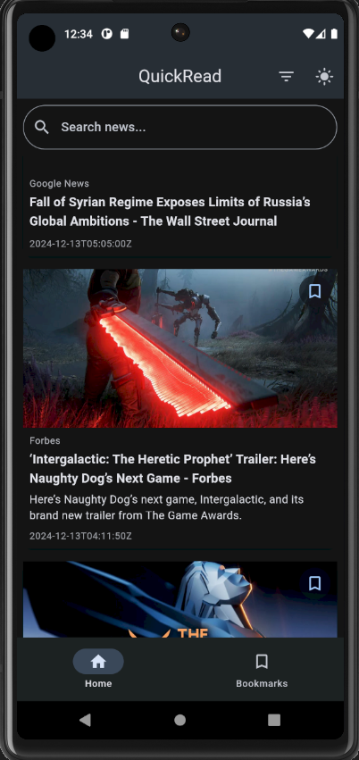
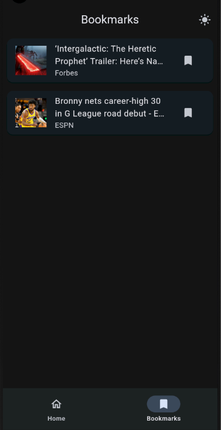
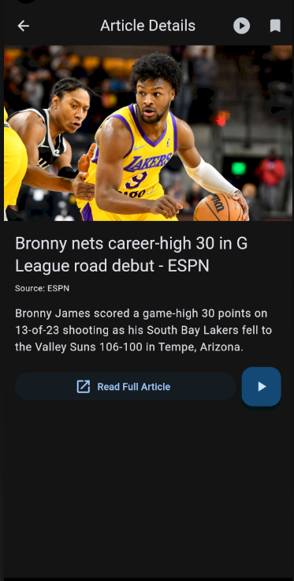
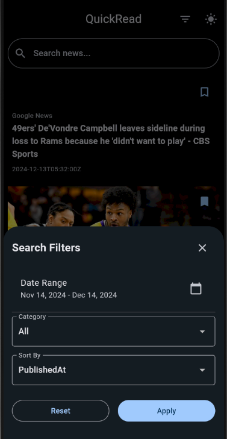
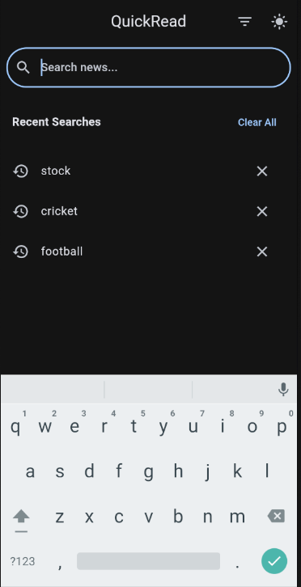

# 📰 QuickRead

## Overview
QuickRead is a modern, feature-rich mobile application built with Flutter that provides users with the latest news articles from around the world. The app offers a seamless and interactive news reading experience with multiple advanced features.

## 🌟 Key Features

### 1. News Browsing
- Fetch and display latest news articles
- Support for top headlines and search functionality
- Clean, modern UI with card-based article display

### 2. Theme Customization
- Light and Dark mode support
- Smooth theme switching
- Persistent theme preference

### 3. Advanced Search Filters
- Date range filtering for news articles
- Source and category selection options
- Sorting by published date, relevancy, or popularity
- User-friendly interface for applying filters

### 4. Search Functionality
- Real-time news search
- Search history management
- Easy access to recent searches

### 5. Text-to-Speech
- Article content reading feature
- Play/Pause/Stop speech controls
- Clear US English pronunciation

### 6. Bookmarking
- Save favorite articles
- Dedicated bookmarks screen
- Easy bookmark management

### 7. Article Interaction
- Full article URL launching
- Detailed article view
- Share and read full articles

## 📸 Screenshots

Here are some screenshots of the app in action:

### Home Screen


### Bookmarks Screen


### Article Details


### Search Filter


### Search Functionality


## 🏗 Architecture

The application follows the **MVVM (Model-View-ViewModel)** architecture pattern, enhanced by the **Provider** package for state management. This structure promotes a clear separation of concerns:

- **Model**: Represents data structures and business logic (e.g., `Article`, `SearchFilters`, `NewsService`).
- **View**: Comprises UI components that display data and interact with users (e.g., `HomeScreen`, `ArticleDetailsScreen`).
- **ViewModel**: Managed by the `Provider`, it holds the app's state and business logic, notifying the View of any changes (e.g., `NewsProvider`, `SearchHistoryProvider`).

This architecture enables reactive programming, allowing the UI to automatically update in response to state changes, making the app scalable and maintainable.

## 🛠 Technologies Used
- Flutter
- Dart
- Provider for State Management
- News API for fetching articles
- SharedPreferences for local storage
- flutter_tts for text-to-speech
- url_launcher for opening web links

## 📦 Dependencies
- flutter_tts: Text-to-Speech functionality
- provider: State management
- shared_preferences: Local data persistence
- url_launcher: Opening web URLs
- http: Network requests

## 🚀 Getting Started

### Prerequisites
- Flutter SDK (latest stable version)
- Android Studio or VS Code with Flutter extensions
- Android/iOS simulator or physical device

### Installation Steps
1. Clone the repository
```bash
git clone https://github.com/Sanmoy1/QuickRead.git
cd QuickRead
```

2. Install dependencies
```bash
flutter pub get
```

3. Get a News API Key
- Visit [NewsAPI.org](https://newsapi.org/)
- Sign up and get a free API key
- Replace the API key in the NewsProvider

4. Run the app
```bash
flutter run
```

## 🔧 Configuration
- Modify `lib/providers/news_provider.dart` to update API key
- Adjust TTS settings in `lib/providers/tts_provider.dart`

## 🌈 App Screens
1. Home Screen
   - Latest news articles
   - Search functionality
   - Theme toggle

2. Article Details Screen
   - Full article preview
   - Text-to-Speech
   - Open full article
   - Bookmark option

3. Bookmarks Screen
   - Saved articles
   - Theme toggle
   - Article management

## 🔒 Permissions
- Internet access
- Text-to-Speech engine access

## 🤝 Contributing
1. Fork the repository
2. Create your feature branch
3. Commit your changes
4. Push to the branch
5. Create a Pull Request

## 🐛 Reporting Issues
Report issues and bugs on the GitHub repository issues page.

---

**Happy Reading! 📖✨**
